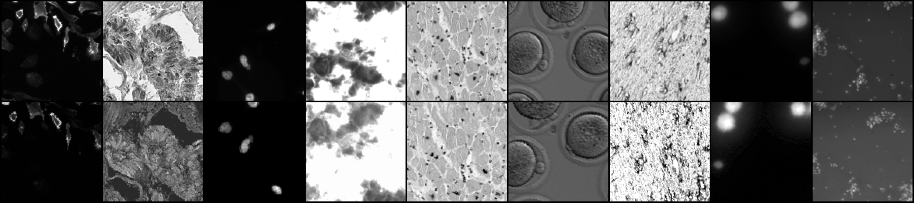

# BINDER

**On Identification and Retrieval of Near-Duplicate Biological Images: a New Dataset and Baseline** 
T.E. Koker, S.S. Chintapalli, S. Wang, B.A. Talbot, D. Wainstock, M. Cicconet, and M. Walsh

Paper: 
Dataset: idac.hms.harvard.edu/binder 
Website:

Abstract: *Manipulation and re-use of images in scientific publications is a
growing issue, not only for biomedical publishers, but also for the research
community in general. In this work we introduce BINDER -- Bio-Image
Near-Duplicate Examples Repository, a novel dataset to help researchers develop,
train, and test models to detect same-source biomedical images. BINDER contains
7,490 unique image patches -- the training set -- as well as 1,821 patches --
split in validation and test sets -- with accompanying manipulations obtained by
means of transformations including rotation,  translation,  scale,  perspective
transform, contrast adjustment and/or compression artifacts. In addition to the
dataset, we show how existing image retrieval and metric learning models can be
applied to achieve high-accuracy inference results, creating a baseline for
future work. The dataset is available at idac.hms.harvard.edu/binder, and
the source code for models and manipulations will be available upon
publication.*

